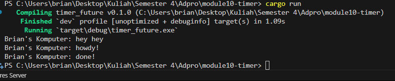

# Module 10

Muhammad Brian Subekti 2306256444

## 1.2 Understanding how it works.

### The screenshot

When I call `spawner.spawn(async { ... })`, the asynchronous task is merely enqueued for later execution rather than running immediately. The following synchronous call, `println!("Brian's Komputer: hey hey");`, executes right away, printing “hey hey” before the executor ever begins polling the spawned future. Only after dropping the spawner and invoking `executor.run()` does the executor pull tasks off its queue to start processing them.

Inside the executor’s loop, the future is polled for the first time, which prints “howdy!” and sets up a 2-second timer before returning `Poll::Pending`. When the timer fires, it re-queues the task, and on the second poll the future completes, printing “done!”. This two-stage polling model, combined with the initial synchronous print in `main`, yields the observed output sequence.

## 1.3 Mutiple Spawn and removing drop

### Before Removing drop(spawner)

.png)
When I call spawner.spawn(async { ... }), the asynchronous task is merely enqueued for later execution rather than running immediately. The following synchronous call, println!("Brian's Komputer: hey hey");, executes right away, printing “hey hey” before the executor ever begins polling the spawned future. Only after dropping the spawner and invoking executor.run() does the executor pull tasks off its queue to start processing them. This leads to the output order: "hey hey" → "howdy!" → wait → "done!".
### After Removing drop(spawner)

.png)
Removing drop(spawner) as seen in the second image introduces an important change. Without explicitly dropping the Spawner, the executor.run() call does not know when to terminate. The internal sync_channel remains open since the Spawner still holds a reference to the sending end. This allows for additional tasks to be added after the executor begins, and thus it waits indefinitely for the sender to close. However, in practice, the executor still continues running the existing queued tasks, resulting in the correct task output, but it hangs after the last task due to the open channel.